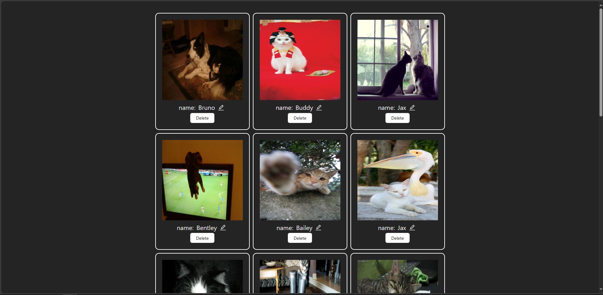
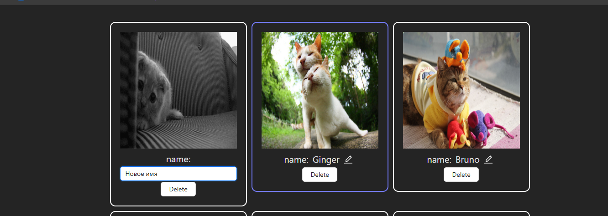
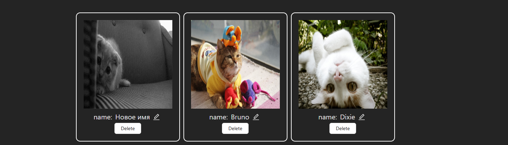

Тестовое задание на Fronted developer

Необходимо получить с сервера и отобразить список элементов. Список должен поддерживать бесконечный плавный скролл, постепенную подгрузку элементов, локальное удаление и редактирование.


Стек:

```
TS
React + MobX
Vite
Jest + RTL
```

Взял [Сat Api](https://developers.thecatapi.com/view-account/ylX4blBYT9FaoVd6OhvR?report=bOoHBz-8t)

Пример получения первой страницы

```
curl "https://api.thecatapi.com/v1/images/search?limit=10&page=0"
```

Отображение Первоначальной страницы



Изменение имени



Отображение нового имени и удаление второй карточки


